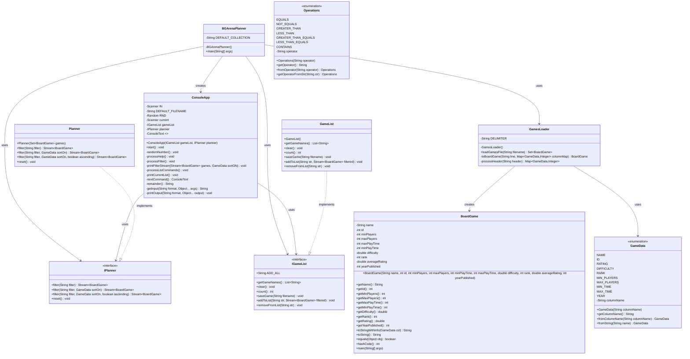

# Board Game Arena Planner Design Document

This document is meant to provide a tool for you to demonstrate the design process. You need to work on this before you code, and after have a finished product. That way you can compare the changes, and changes in design are normal as you work through a project. It is contrary to popular belief, but we are not perfect our first attempt. We need to iterate on our designs to make them better. This document is a tool to help you do that.

## (INITIAL DESIGN): Class Diagram 

Place your class diagrams below. Make sure you check the file in the browser on github.com to make sure it is rendering correctly. If it is not, you will need to fix it. As a reminder, here is a link to tools that can help you create a class diagram: [Class Resources: Class Design Tools](https://github.com/CS5004-khoury-lionelle/Resources?tab=readme-ov-file#uml-design-tools)

### Provided Code

Provide a class diagram for the provided code as you read through it.  For the classes you are adding, you will create them as a separate diagram, so for now, you can just point towards the interfaces for the provided code diagram.

### Your Plans/Design

Create a class diagram for the classes you plan to create. This is your initial design, and it is okay if it changes. Your starting points are the interfaces. 

## (INITIAL DESIGN): Tests to Write - Brainstorm

Write a test (in english) that you can picture for the class diagram you have created. This is the brainstorming stage in the TDD process. 

> [!TIP]
> As a reminder, this is the TDD process we are following:
> 1. Figure out a number of tests by brainstorming (this step)
> 2. Write **one** test
> 3. Write **just enough** code to make that test pass
> 4. Refactor/update  as you go along
> 5. Repeat steps 2-4 until you have all the tests passing/fully built program

You should feel free to number your brainstorm. 

for GameList:
1. Test that a new GameList is empty 
2. Test adding a single game to the list 
3. Test removing a game from the list
4. Test that getGameNames() returns names in case-insensitive alphabetical order
5. Test saving the game list to a file

for Planner:
6. Test basic filtering (empty string returns all games)
7. Test filtering by game name with contains operator (~=)
8. Test filtering by a numeric field 
9. Test handling multiple filter conditions with comma separators 
10. Test that reset() clears all filters

## (FINAL DESIGN): Class Diagram

Go through your completed code, and update your class diagram to reflect the final design. Make sure you check the file in the browser on github.com to make sure it is rendering correctly. It is normal that the two diagrams don't match! Rarely (though possible) is your initial design perfect. 

For the final design, you just need to do a single diagram that includes both the original classes and the classes you added. 

> [!WARNING]
> If you resubmit your assignment for manual grading, this is a section that often needs updating. You should double check with every resubmit to make sure it is up to date.

```mermaid
classDiagram
    BGArenaPlanner --> IPlanner: uses
    BGArenaPlanner --> IGameList: uses
    BGArenaPlanner --> ConsoleApp: creates
    BGArenaPlanner --> GamesLoader: uses

    ConsoleApp --> IGameList: uses
    ConsoleApp --> IPlanner: uses

    GameList ..|> IGameList: implements
    Planner ..|> IPlanner: implements

    GameSorter <-- Planner: uses
    Operations <-- Planner: uses

    GamesLoader --> BoardGame: creates
    GamesLoader --> GameData: uses

    class BGArenaPlanner {
        <<utility>>
        -DEFAULT_COLLECTION$ String
        -BGArenaPlanner()
        +main(args String[])$ void
    }

    class BoardGame {
        -name: String
        -id: int
        -minPlayers: int
        -maxPlayers: int
        -maxPlayTime: int
        -minPlayTime: int
        -difficulty: double
        -rank: int
        -averageRating: double
        -yearPublished: int
        +BoardGame(name, id, minPlayers, maxPlayers, minPlayTime, maxPlayTime, difficulty, rank, averageRating, yearPublished)
        +getName() String
        +getId() int
        +getMinPlayers() int
        +getMaxPlayers() int
        +getMaxPlayTime() int
        +getMinPlayTime() int
        +getDifficulty() double
        +getRank() int
        +getRating() double
        +getYearPublished() int
        +toStringWithInfo(col GameData) String
        +toString() String
        +equals(obj Object) boolean
        +hashCode() int
    }

    class ConsoleApp {
        -IN$ Scanner
        -DEFAULT_FILENAME$ String
        -RND$ Random
        -current: Scanner
        -gameList: IGameList
        -planner: IPlanner
        +ConsoleApp(gameList IGameList, planner IPlanner)
        +start() void
        -randomNumber() void
        -processHelp() void
        -processFilter() void
        -printFilterStream(games Stream~BoardGame~, sortON GameData)$ void
        -processListCommands() void
        -printCurrentList() void
        -nextCommand() ConsoleText
        -remainder() String
        -getInput(format String, args Object...)$ String
        -printOutput(format String, output Object...)$ void
    }

    class GameData {
        <<enumeration>>
        NAME
        ID
        RATING
        DIFFICULTY
        RANK
        MIN_PLAYERS
        MAX_PLAYERS
        MIN_TIME
        MAX_TIME
        YEAR
        -columnName: String
        +GameData(columnName)
        +getColumnName() String
        +fromColumnName(columnName String)$ GameData
        +fromString(name String)$ GameData
    }

    class GamesLoader {
        <<utility>>
        -DELIMITER$ String
        -GamesLoader()
        +loadGamesFile(filename String)$ Set~BoardGame~
        -toBoardGame(line String, columnMap Map~GameData,Integer~)$ BoardGame
        -processHeader(header String)$ Map~GameData,Integer~
    }

    class Operations {
        <<enumeration>>
        EQUALS
        NOT_EQUALS
        GREATER_THAN
        LESS_THAN
        GREATER_THAN_EQUALS
        LESS_THAN_EQUALS
        CONTAINS
        -operator: String
        +Operations(operator)
        +getOperator() String
        +fromOperator(operator String)$ Operations
        +getOperatorFromStr(str String)$ Operations
    }

    class IGameList {
        <<interface>>
        +ADD_ALL$ String
        +getGameNames() List~String~
        +clear() void
        +count() int
        +saveGame(filename String) void
        +addToList(str String, filtered Stream~BoardGame~) void
        +removeFromList(str String) void
    }

    class IPlanner {
        <<interface>>
        +filter(filter String) Stream~BoardGame~
        +filter(filter String, sortOn GameData) Stream~BoardGame~
        +filter(filter String, sortOn GameData, ascending boolean) Stream~BoardGame~
        +reset() void
    }

    class GameList {
        -listOfGames: Set~BoardGame~
        +GameList()
        +getGameNames() List~String~
        +clear() void
        +count() int
        +saveGame(filename String) void
        +addToList(str String, filtered Stream~BoardGame~) void
        +removeFromList(str String) void
        -addRange(range String, filteredList List~BoardGame~) void
        -removeRange(range String, gamesList List~BoardGame~) void
    }

    class Planner {
        -allGames: Set~BoardGame~
        -gamesList: List~BoardGame~
        +Planner(games Set~BoardGame~)
        +filter(filter String) Stream~BoardGame~
        +filter(filter String, sortOn GameData) Stream~BoardGame~
        +filter(filter String, sortOn GameData, ascending boolean) Stream~BoardGame~
        +reset() void
        -applyFilterCondition(filterCondition String, games List~BoardGame~) List~BoardGame~
        -matchesFilter(game BoardGame, filterOn GameData, operator Operations, value String) boolean
        -matchesStringFilter(gameValue String, operator Operations, filterValue String) boolean
        -matchesNumberFilter(gameValue int, operator Operations, filterValue String) boolean
        -matchesDoubleFilter(gameValue double, operator Operations, filterValue String) boolean
        -sortGames(games List~BoardGame~, sortOn GameData, ascending boolean) List~BoardGame~
    }

    class GameSorter {
        <<utility>>
        -GameSorter()
        +sortFilteredGames(sortOn GameData, ascending boolean)$ Comparator~BoardGame~
        -getBaseComparator(sortOn GameData)$ Comparator~BoardGame~
    }
```

## (FINAL DESIGN): Reflection/Retrospective

> [!IMPORTANT]
> The value of reflective writing has been highly researched and documented within computer science, from learning to information to showing higher salaries in the workplace. For this next part, we encourage you to take time, and truly focus on your retrospective.

Take time to reflect on how your design has changed. Write in *prose* (i.e. do not bullet point your answers - it matters in how our brain processes the information). Make sure to include what were some major changes, and why you made them. What did you learn from this process? What would you do differently next time? What was the most challenging part of this process? For most students, it will be a paragraph or two. 

When I implemented the BoardGame Arena Planner, the final design had several changes from the initial design. The most notable change was implementing the Strategy Pattern through the GameSorter class, which I added based on TA's feedback of Check-In highlighting the importance of separating sorting logic from the Planner class. This improved code maintainability and adherence to the single responsibility principle. In GameList, I chose a HashSet as the underlying data structure to ensure no duplicate games, and added helper methods like addRange and removeRange to improve modularity. The planner implementation was more complex than initially anticipated, requiring specialized methods for different comparison types (matchesStringFilter, matchesNumberFilter, matchesDoubleFilter), another improvement inspired by TA’s suggestion in Check-In.

Throughout this process, I gained a deeper understanding of interface design and how to implement flexible sorting functionality through the Strategy Pattern. I also learned how to handle complex string parsing and filtering operations while maintaining clear and modular code. If starting over, I would spend more time on upfront design, particularly considering the complexity of sorting and filtering operations. I might introduce the Strategy Pattern earlier and consider using the Factory Pattern to create different types of filters. The most challenging part was implementing string parsing and handling various edge cases, especially when processing user-provided ranges and filter conditions.